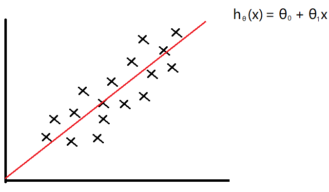
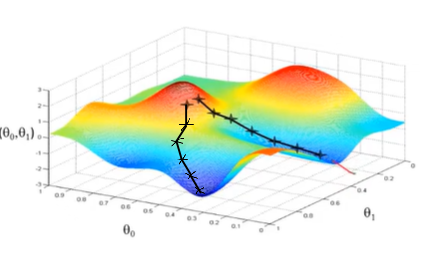

# 深度学习

+ 监督学习：给定带有特征和正确答案的数据集进行学习，用以通过给定特征，能预测出正确答案
  + 回归问题：获取的是连续值输出
  + 离散问题：获取的是离散值输出
+ 无监督学习：给定数据集（没有答案），对数据就行分类（比如新闻分类）

## 监督学习

### 代价函数

+ 以通过房子面积估计价格为例，按`线性回归`模型进行拟合，假设函数如下

   

+ 我们得数据是一系列面积x与房价y的集合，我们的目标是使得代价函数的值最小

   

  也就是所有面积下，实际价格与预测价格的平均误差最小

  > + 其中的`1/2`系数，用来抵消平方求导时产生的系数2
  > + x的平方的导函数为`2x`，求导过程参见[知乎](https://www.zhihu.com/question/429265678)
  > + 但是这里为什么涉及导函数？

+ 当我们使用同一组数据进行拟合时，能得到下面这样的三维图形

   

  把他转换为等高线图

   

  相同颜色的线表示`J(θ0,θ1)`的值相同，我们要取的最小值，就在中心的那个点

### 梯度下降算法

+ 用于将其他函数最小化

#### 定义

+ 公式

   

+ 重复以下步骤直至收敛

  分别在原函数的几个坐标方向上取下一个点的坐标值，然后把新值赋给原函数的参数

   

+ 公式详解

  + `θj`：表示原函数的各个参数，可以表示`θ0`或者`θ1`

  + `:=`：这里表示赋值，`=`用于判断

  + `α`：表示学习率，也就是每次下降的步长

    这个值太大会导致结果越来越发散，无法收敛

    太小会导致下降速度很慢，需要更多步骤

  + 最后部分

     

    这个整体表示原函数在(θ0,θ1)上对θj的偏导

#### 演示

+ 假设我们对一个简单函数`J(θ0)`使用梯度下降算法找出最小值，则公式为

   

+ 图示过程

    

  从`θ0`出发，逐步靠近最低点

  + 因为越接近最低点，偏导数的绝对值越小，所以每次前进的步长也是越来越小的，直到到达最低点，偏导数为0
  + 在曲线的左半部分，偏导数为负数，所以下一个点会在当前点右侧；在曲线的右半部分，偏导数为正数，所以下一个点会在当前点左侧

+ 当我们对一个复杂函数`J(θ0,θ1)`使用梯度下降算法时，可能会因为出发点的略微差异，导致找到两个不同的局部最低点

   

  